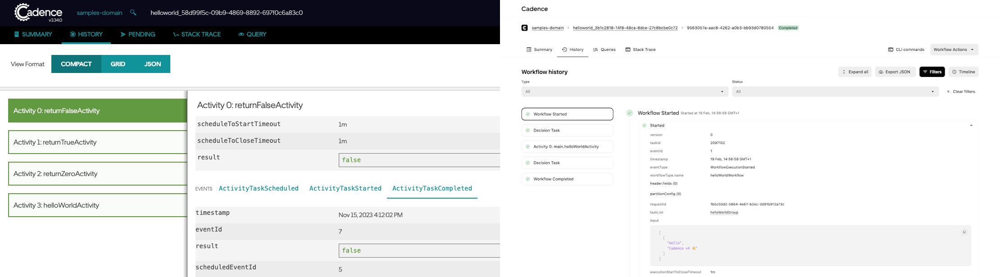

We are excited to announce the release of **cadence-web v4.0.0**—a complete rewrite of the Cadence web app. Cadence has always been about empowering developers to manage complex workflows, and with this release, we not only modernize the web interface by embracing today’s cutting-edge technologies but also strengthen the open source community by aligning our tools with the broader trends seen across the industry.

## What's new in cadence-web v4.0.0
- **Revamped UI & Experience** – A fresh, modern interface designed for better usability and efficiency.
- **Multi-Cluster Support** – The UI can now connect to multiple Cadence clusters.
- **Performance Improvements** – Faster load times, optimised API calls, and a smoother experience.

<!-- truncate -->

*Comparison of the workflow history page between the old UI and the new UI*

*Interaction with a multi-cluster Cadence setup in the old UI vs in the new UI*

## Challenges with the older cadence-web
The older version of cadence-web had several issues for both users and Cadence developers alike. 

Users had to deal with slow loading and performance, and a suboptimal user experience filled with janky errors. Moreover, it did not work very well with multi-cluster setups, since each cadence-web server was tied to a single cluster.

For Uber developers working on cadence-web, the main challenge was a different technology stack and UI framework. cadence-web was written in Vue.js, whereas the frameworks in use at Uber are all React-based. This slowed down developers working on cadence-web because they had to suddenly adapt to working on an entirely different framework. Moreover, the project used outdated tooling, was hard to run, and was not type-safe. 

Our internal version of cadence-web used an NPM package as a dependency, which limited our ability to extend it with Uber-specific enhancements. It also had a high dependency on run-time configurations, limiting how much could be tested while running locally.

## The development journey
After evaluating multiple open source React-based frameworks, we chose to go with Vercel’s Next.js, which brings with it several of React’s bleeding edge optimizations, such as server components.

### What went into making the new cadence-web
We took the migration as an opportunity to make the hop from plain JavaScript to TypeScript, while integrating Jest for testing and ESLint with Prettier for code quality.

For data validation, we chose Zod, a popular schema validation library that provides runtime type checking and automatic type inference. For logging, we went with Pino, a well-established logging library that can integrate with monitoring tools like Sentry.

The UI itself is built with Baseweb, Uber’s open-source component library. Baseweb is heavily integrated with Styletron, so we used that as our CSS-in-JS solution.

To interact with Cadence services, the web UI uses React Query for data management, Next.js API routes as intermediaries, and grpc’s official JavaScript client ([@grpc/grpc-js](https://www.npmjs.com/package/@grpc/grpc-js)). Type generation for Cadence endpoints (request and response params) is handled by using [@grpc/proto-loader](https://www.npmjs.com/package/@grpc/proto-loader) to generate Typescript types from our existing Protobuf definitions.

### Extending cadence-web internally
Since we wanted the ability to extend the codebase for specific use cases, we also designed the code in a modular fashion, allowing pieces of the UI to be added, replaced or removed using simple configurations. 

Our internal fork of cadence-web uses a virtual codebase which applies a set of internal overrides to the open source codebase using overlayfs while developing locally, and npm’s merge-dirs package at build time. This allows us to add extensions at will, and also modify certain files internally to meet use case-specific needs. To handle open-source changes to these modified files, we have a validation script that runs on every version update to highlight potential conflicts.

### A unified view for Workflow History
Previously, the Workflow History experience was fragmented across multiple disconnected views—Compact, Grid, and JSON—each serving a different purpose but offering little cohesion. Depending on where you started, the experience varied significantly, making it difficult to navigate between views or maintain context. For example, users couldn’t easily locate an event in the compact view and then explore its surrounding context in the grid; they had to search again. Additionally, filtering was only available in the grid view, leaving the others lacking in usability.

This disjointed setup made it hard for users to build intuitive flows or develop habits around history navigation.

With this launch, we've reimagined the entire experience into a single, unified view that works seamlessly across use cases. The compact list and timeline now live side by side, enabling users to quickly locate an event and view its context in the timeline. Filters apply across both views, ensuring consistency and saving time. JSON export remains available, and new features like collapsible events bring the best of both Summary and Full Detail modes into one place.

## How to Get Started
* **GitHub Repository:** You can find cadence-web v4.0.0 in our [GitHub repository](https://github.com/cadence-workflow/cadence-web).  
* **Dockerhub:** cadence-web v4.0.0 is also available on [Dockerhub](https://hub.docker.com/r/ubercadence/web), and  will be fetched by default when you run Cadence using Docker.

## What’s Next?
Now that we have a robust and modernized Cadence UI, our long-term plan is to enhance it to add more useful functionality. Our next steps include:

* **Workflow Actions:** Adding more workflow actions such as start, restart, reset, and signal, allowing them to be invoked directly from the UI  
* **Extended Domain Information:** We will be adding more information to the Domain page to help you work with your domains and quickly identify any issues affecting them.  
* **Workflow Diagnostics UI:** Integrating with the new Workflow Diagnostics API to provide detailed insights into failed workflows.

We invite you to explore cadence-web v4.0.0 and share your feedback with us. Please feel free to share your feedback with the new Cadence UI in our [Slack workspace](http://t.uber.com/cadence-slack)\! Your input is invaluable as we continue to evolve this platform.

Happy coding, and thank you for being a part of the Cadence journey\!