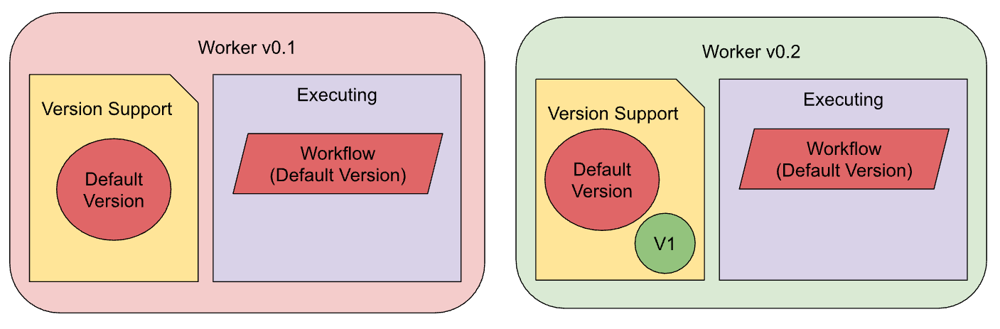
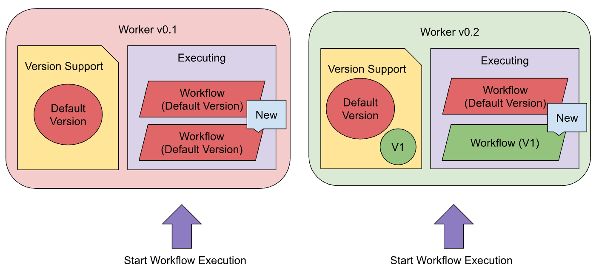
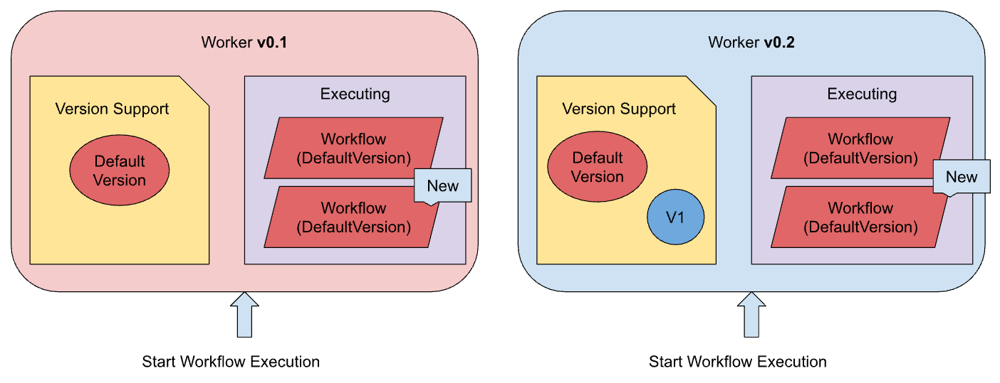
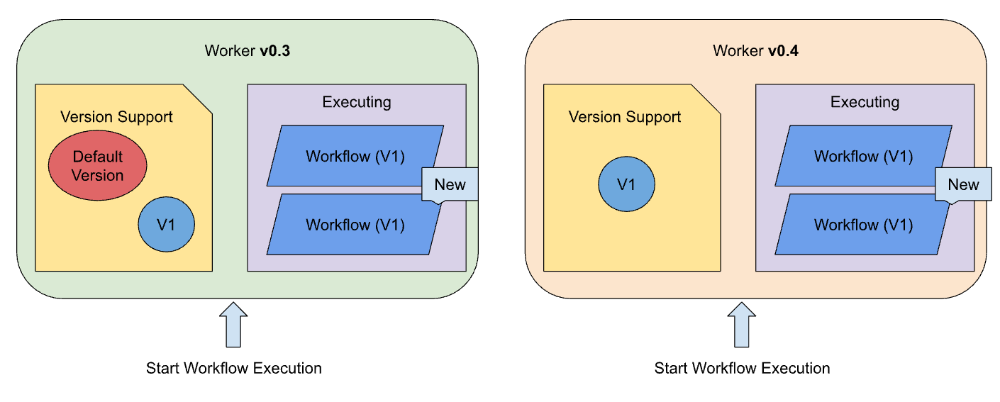

At Uber, we manage billions of workflows with lifetimes ranging from seconds to years. Over the course of their lifetime, workflow code logic often requires changes. To prevent non-deterministic errors that changes may cause, Cadence offers [a Versioning feature](https://cadenceworkflow.io/docs/go-client/workflow-versioning). However, the feature's usage is limited because changes are only backward-compatible, but not forward-compatible. This makes potential rollbacks or workflow execution rescheduling unsafe.

To address these issues, we have made recent enhancements to [the Versioning API](https://cadenceworkflow.io/docs/go-client/workflow-versioning), enabling the safe deployment of versioned workflows by separating code changes from the activation of new logic.

## What is a Versioned Workflow?

Cadence reconstructs a workflow's execution history by replaying past events against your workflow code, expecting the exact same outcome every time. If your workflow code changes in an incompatible way, this replaying process can lead to non-deterministic errors.

A versioned workflow uses a [Versioning feature](https://cadenceworkflow.io/docs/go-client/workflow-versioning) to help you avoid errors. This allows developers to safely update their workflow code without breaking existing executions. The key is the `workflow.GetVersion` function (available in [Go](https://cadenceworkflow.io/docs/go-client/workflow-versioning) and [Java](https://cadenceworkflow.io/docs/java-client/versioning)). By using `workflow.GetVersion`, you can mark points in your code where changes occur, ensuring that future calls will return a specific version number.

Before the rollout, only instances of workflow code **v0.1** existed:

```go
v := workflow.GetVersion(ctx, "change-id", workflow.DefaultVersion, 1)
if v == workflow.DefaultVersion {
    err = workflow.ExecuteActivity(ctx, ActivityA, data).Get(ctx, &result1)
} else {
    err = workflow.ExecuteActivity(ctx, ActivityC, data).Get(ctx, &result1)
}
```

### Deployment flow

Let’s consider an example deployment of a change from workflow code **v0.1**, where only `FooActivity` is supported.

```go
// Git tag: v0.1 
func MyWorkflow(ctx workflow.Context) error {
    return workflow.ExecuteActivity(ctx, FooActivity).Get(ctx, nil)
}
```

to workflow code **v0.2**, which introduces a new `BarActivity` and utilizes the Versioning feature:

```go
// Git tag: v0.2 
func MyWorkflow(ctx workflow.Context) error {
	version := workflow.GetVersion(ctx, "MyChange", workflow.DefaultVersion, 1)
	if version == workflow.DefaultVersion {
		return workflow.ExecuteActivity(ctx, FooActivity).Get(ctx, nil) 
	}
return workflow.ExecuteActivity(ctx, BarActivity).Get(ctx, nil)
}
```

Before the rollout, only instances of workflow code **v0.1** existed:


Rollouts are typically performed gradually, with new workers replacing previous worker instances one at a time. This means that multiple workers with workflow code **v0.1** and **v0.2** can exist simultaneously. When a worker is replaced, a running workflow execution is rescheduled to another worker. Thanks to the Versioning feature, a worker with workflow code **v0.2** can support a workflow execution started by a worker with workflow code **v0.1**.


During rollouts, the service should continue to serve production traffic, allowing new workflows to be initiated. If a new worker processes a "Start Workflow Execution" request, it will execute a workflow based on the new version. However, if an old worker handles the request, it will start a workflow based on the old version.



If a rollout is completed successfully, both the new and old workflows will continue to execute simultaneously.


## Versioned Workflow Rescheduling Problem

Workflows typically execute on the same worker on which they started. However, various factors can necessitate rescheduling with a different worker.:

* **Worker Shutdown**: Occurs when a worker is shut down due to reasons such as rollouts, rollbacks, restarts, or instance crashes.
* **Worker Unavailability**: Occurs when a worker is running but loses connection to the server, becoming unavailable.
* **High Traffic Load**: Occurs when a worker's sticky cache is fully utilized, preventing further workflow execution and causing the server to reschedule the workflow to another worker.

During a rollout or rollback, workflow rescheduling for workflow executions with new versions becomes unsafe, especially during rollbacks:


* If an old workflow is rescheduled to either an old or a new worker, it generally processes correctly.
* If a new workflow is rescheduled to an old worker, it will be blocked or even fail (depending on `NonDeterministicWorkflowPolicy`).

### Why did it happen?

The old worker doesn't support the new version and cannot replay its history correctly, which leads to a non-deterministic error. The Versioning API allowed customers to make only backward-compatible changes to workflow code definitions; however, these changes were not forward-compatible.

At the same time, there were no workarounds allowing customers to make these changes forward-compatible, so they couldn't separate code changes from the activation of the new version.

### What impact did we have at Uber?

Depending on the workflow code, code changes, and impact, to eliminate the negative impact of a rollback, a Cadence customer needed to identify all problematic workflows, terminate them if they did not fail automatically, and restart them. These steps resulted in a significant on-call burden, leading to possible SLO violations and incidents.

Based on customer impact, we introduced changes in the Versioning API, enabling customers to separate code changes from the activation of the new version.

## ExecuteWithVersion and ExecuteWithMinVersion

The recent release of the Go SDK (Java soon) has extended the GetVersion function and introduced two new options:

```go
// When it's executed for the first time, it returns 2, instead of 10 
version := workflow.GetVersion(ctx, "changeId", 1, 10, workflow.ExecuteWithVersion(2))

// When it's executed for the first time, it returns 1, instead of 10 
version := workflow.GetVersion(ctx, "changeId", 1, 10, workflow.ExecuteWithMinVersion())
```

These two new options enable customers to choose which version should be returned when `GetVersion` is executed for the first time, instead of the maximum supported version.

* `ExecuteWithVersion` returns a specified value.
* `ExecuteWithMinVersion` returns a minimal supported version.

Let’s extend the example above and consider the deployment of versioned workflows with new functions:

### Deployment of Versioned workflows

#### Step 0

The initial version remains **v0.1**

```go
// Git tag: v0.1 
// MyWorkflow supports: workflow.DefaultVersion 
func MyWorkflow(ctx workflow.Context) error {
return workflow.ExecuteActivity(ctx, FooActivity).Get(ctx, nil)
}
```

When a `StartWorkflowExecution` request is processed, a new workflow execution will have a `DefaultVersion` of the upcoming change ID.


#### Step 1

`GetVersion` is still used; however, `workflow.ExecuteWithVersion` has also been added.

```go
// Git tag: v0.2   
// MyWorkflow supports: workflow.DefaultVersion and 1
func MyWorkflow(ctx workflow.Context) error {    
    // When GetVersion is executed for the first time, workflow.DefaultVersion will be returned
    version := workflow.GetVersion(ctx, "MyChange", workflow.DefaultVersion, 1, workflow.ExecuteWithVersion(workflow.DefaultVersion))
    
    if version == workflow.DefaultVersion {
       return workflow.ExecuteActivity(ctx, FooActivity).Get(ctx, nil)
    }
    return workflow.ExecuteActivity(ctx, BarActivity).Get(ctx, nil)
}
```

Worker **v0.2** contains the new workflow code definition that supports the new logic. However, when a StartWorkflowExecution request is processed, a new workflow execution will still have the default version of the “MyChange” change ID.



This change enables customers to easily roll back to worker **v0.1** without encountering any non-deterministic errors.

#### Step 2

Once all **v0.2** workers are replaced with **v0.1** workers, we can deploy a new worker that begins workflow executions with the new version.

```go
// Git tag: v0.3   
// MyWorkflow supports: workflow.DefaultVersion and 1
func MyWorkflow(ctx workflow.Context) error {    
    // When GetVersion is executed for the first time, Version #1 will be returned 
    version := workflow.GetVersion(ctx, "MyChange", workflow.DefaultVersion, 1)
    
    if version == workflow.DefaultVersion {
       return workflow.ExecuteActivity(ctx, FooActivity).Get(ctx, nil)
    }
    return workflow.ExecuteActivity(ctx, BarActivity).Get(ctx, nil)
}
```

Worker **v0.3** contains the new workflow code definition that supports the new logic while still supporting the previous logic. Therefore, when a StartWorkflowExecution request is processed, a new workflow execution will have Version \#1 of the “MyChange” change ID.


This change enables customers to easily roll back to worker **v0.2** without any non-deterministic errors, as both worker versions support "DefaultVersion" and "Version \#1" of the “MyChange” change ID.

#### Step 3

Once all workers **v0.3** replace the old worker **v0.2** and all workflows with the DefaultVersion of “MyChange” are **finished**, we can deploy a new worker that starts workflow executions with the new version and doesn’t support the previous logic.

```go
// Git tag: v0.4     
// MyWorkflow supports: 1
func MyWorkflow(ctx workflow.Context) error {    
    // When GetVersion is executed for the first time, Version #1 will be returned 
    _ := workflow.GetVersion(ctx, "MyChange", 1, 1)
    return workflow.ExecuteActivity(ctx, BarActivity).Get(ctx, nil)
  }
```

Worker **v0.4** contains the new workflow code definition that supports the new logic but does not support the previous logic. Therefore, when a StartWorkflowExecution request is processed, a new workflow execution will have Version \#1 of the “MyChange” change ID.



This change finalizes the safe rollout of the new versioned workflow. At each step, both versions of workers are fully compatible with one another, making rollouts and rollbacks safe.

#### Differences with the previous deployment flow

The previous deployment flow for versioned workflows included only Steps 0, 2, and 3\. Therefore, a direct upgrade from Step 0 to Step 2 (skipping Step 1\) was not safe due to the inability to perform a safe rollback. The new functions enabled customers to have Step 1, thereby making the deployment process safe.

## Conclusion

The new options introduced into `GetVersion` address gaps in the Versioning logic that previously led to failed workflow executions. This enhancement improves the safety of deploying versioned workflows, allowing for the separation of code changes from the activation of new logic, making the deployment process more predictable. This extension of `GetVersion` is a significant improvement that opens the way for future optimizations.
