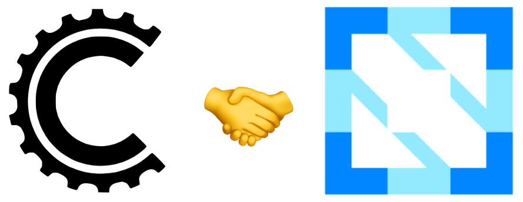

# Cadence Joins the CNCF (Cloud Native Computing Foundation)

We’re proud to announce that [the Cadence project](https://cadenceworkflow.io/) has joined the [CNCF (Cloud Native Computing Foundation)](https://www.cncf.io/)®, the open-source foundation that hosts and maintains critical components of modern cloud-native infrastructure including Kubernetes®, Prometheus®, and Envoy® under the [Linux Foundation](https://www.linuxfoundation.org/)®.

Cadence is an open-source, fault-tolerant, and highly scalable workflow orchestration engine created at Uber to help developers build and run resilient applications. It’s been powering thousands of use cases at Uber and other companies. By managing distributed state, retries, scaling, and failure recovery, Cadence enables teams to focus on business logic rather than infrastructure complexity. Mission-critical applications across industries including finance, e-commerce, healthcare, and transportation depend on Cadence.

Joining CNCF marks a significant milestone for the Cadence project, emphasizing the project’s open source commitment. With its [open governance](https://cadenceworkflow.io/community/governance), companies can join as maintainers and help improve long-term confidence. Increased transparency in roadmap and execution make upcoming features predictable.

Since its inception, the Cadence project’s ecosystem has reached over 150 companies and counting. Partners like NetApp® Instaclustr adopted the project and have offered it as a managed solution at scale. With CNCF’s support, the project aims to further its mission of simplifying distributed service development while delivering production-grade reliability at scale.

In the last several years, Cadence has made significant investments in its scalability, reliability, multitenancy, deployment safety, and portability, laying the necessary foundation to build enterprise-level features at scale, efficiently and reliably. It’s now a great time to build those features together, and we invite anyone to be a part of this future. Especially in the era of AI, Cadence will play a crucial role in durable orchestration. 

## What’s Changing in the Community?

We’ll stop using our Slack workspace ([uber-cadence.slack.com](http://uber-cadence.slack.com)). Going forward, we’ll use CNCF’s Slack workspace ([cloud-native.slack.com](https://cloud-native.slack.com/)). Join this new workspace using [Community Inviter](https://communityinviter.com/apps/cloud-native/cncf) and join the *\#cadence-users* channel to contact us. 

Our website ([cadenceworkflow.io](http://cadenceworkflow.io)) and our GitHub org ([github.com/cadence-workflow](http://github.com/cadence-workflow)) will stay the same and we’ll continue sharing new features from there. 

We’ll publish our roadmap at [https://github.com/orgs/cadence-workflow/projects](https://github.com/orgs/cadence-workflow/projects). We’ll hold community meetings to brainstorm about and prioritize upcoming features. Project tracking will move from internal tools to GitHub. Projects will have dedicated issues so you can track pull requests, updates, and timelines. 

We’ll organize regular meetups (in-person and virtual) to showcase new features, have discussions, and learn from valuable guests. 

For maintainers, we’ll hold regular meetings to update each other. If you’d like to become a maintainer, please contact us on Slack so we can help with starter tasks and larger projects as you gain experience.

## How to Become a Maintainer?

We invite companies that are already using Cadence, or plan to adopt it in the future, to become official maintainers and help shape this critical piece of infrastructure for your organization.

With this important milestone, we are prioritizing the addition of new maintainers and working to make the onboarding experience as smooth as possible. Our goal is to scale the project responsibly across all areas including development, decision making, efficiency, modernization, prioritization, and more.

If you are interested, please reach out to us in the #cadence-users channel mentioned above, and we will help you find suitable projects to contribute to. If you already have something in mind, feel free to open an issue in the appropriate repository under [github.com/cadence-workflow](http://github.com/cadence-workflow).

## Acknowledgments

*CNCF® and the CNCF logo design are registered trademarks of the Cloud Native Computing Foundation.*

*Envoy®, Kubernetes®, Prometheus®, and their logos are registered trademarks of The Linux Foundation® in the United States and other countries. No endorsement by The Linux Foundation is implied by the use of these marks.*

*Instaclustr® and NetApp® are trademarks of NetApp, Inc.*