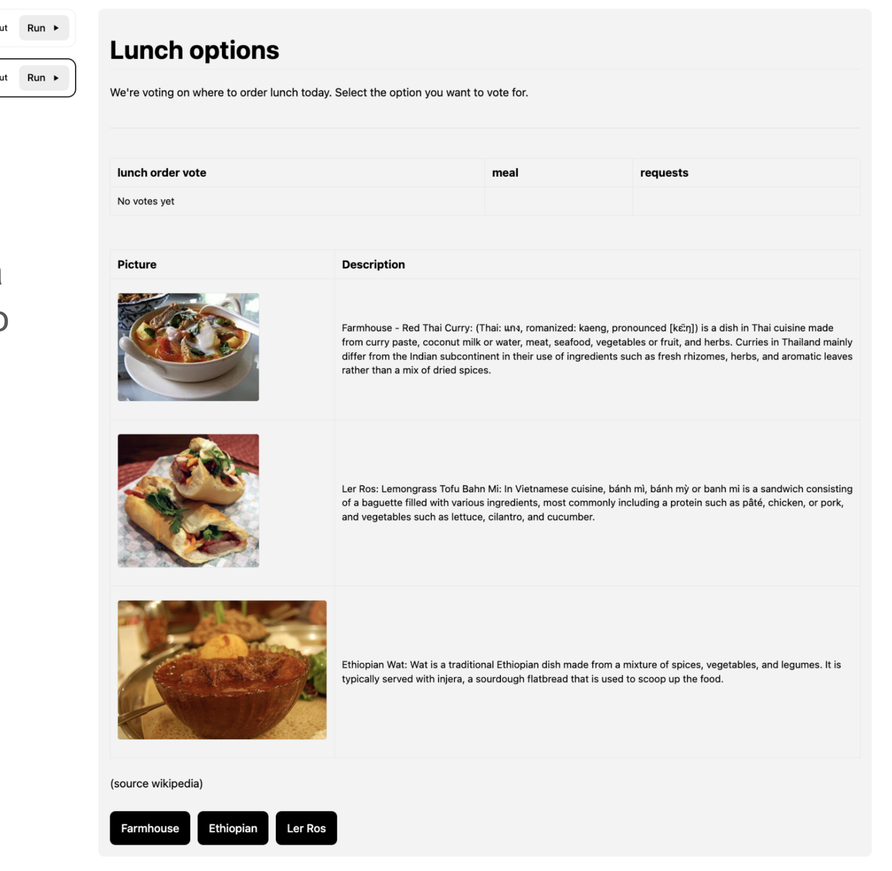

# Workflow Queries with Formatted Data

This guide explains how to implement workflow queries that return preformatted data for enhanced rendering in Cadence Web UI. This feature allows workflow authors to return structured data in Markdown format that can be rendered directly in the Cadence Web interface, providing richer visualization and better user experience.

The formatted data feature enables workflows to respond to queries with data that includes rendering instructions, allowing the UI to display content beyond simple text responses.

---

## Overview

### The Goal

Support rendering preformatted data on cadence-web in places such as the Query API. Examples of data that can be preformatted include:

- **Markdown** - Rich text with formatting, links, and structure

The reason for prerendering is that workflow authors have access to workflow data that they may wish to render on the Cadence UI, and such rendering entirely client-side is difficult given the current Cadence workflow API.

### How It Works

When a workflow query responds with data in a specific shape, Cadence Web can render it with appropriate formatting. The response must include:

1. A response type identifier
2. A MIME type format specifier  
3. The actual formatted data

---

## Response Format

### Basic Structure

To enable formatted rendering, your workflow query must respond with data in the following shape:

```json
{
  "cadenceResponseType": "formattedData",
  "format": "<mime-type format>",
  "data": "<formatted data specific to the format>"
}
```

### Supported MIME Type

The `format` field should contain the supported MIME type identifier:

- `text/markdown` - Markdown content

---

## Examples

### Markdown Response

```json
{
  "cadenceResponseType": "formattedData",
  "format": "text/markdown",
  "data": "### Workflow Status Report\n\n**Current Stage:** Processing\n\n- [x] Data validation completed\n- [x] Initial processing done\n- [ ] Final verification pending\n\n[View detailed logs](https://internal.example.com/logs/workflow-123)\n\n**Progress:** 75% complete"
}
```

This would render as:

### Workflow Status Report

**Current Stage:** Processing

- [x] Data validation completed
- [x] Initial processing done
- [ ] Final verification pending

[View detailed logs](https://internal.example.com/logs/workflow-123)

**Progress:** 75% complete

---

## UI Examples

The following screenshots demonstrate how formatted query responses appear in the Cadence Web UI:

### Restaurant Menu Voting Interface

This example shows a workflow query that returns formatted data for a restaurant lunch voting system, demonstrating how interactive voting interfaces can be presented:



*A lunch voting interface displaying restaurant menu options with images and descriptions. Shows "Farmhouse - Red Thai Curry", "Ler Ros: Lemongrass Tofu Bahn Mi", and "Ethiopian Wat" options with detailed descriptions and voting buttons. The interface includes meal requests tracking and vote counts.*

### Employee Database Query Results

This example shows formatted data returned from an employee database query, demonstrating how tabular data can be presented:


*Employee records displayed in a structured table format showing Employee name, Title, and description columns with sample data for multiple employees.*

### Hello World Workflow Query Results

Here's an example of how query results are displayed for a simple workflow:


*The Hello World Workflow query interface showing basic workflow concepts and activity execution information, including real-world use case details and sample code links.*

### Query Interface

The Queries tab provides an interface for executing workflow queries with various predefined options:


*The Queries tab showing available query operations including `__open_sessions`, `get_runtime_data`, and other predefined queries, along with an "Operator Runbook" option.*

These examples illustrate how the formatted data feature enhances the user experience by providing rich, structured displays instead of raw JSON responses.

---

## Go Implementation

### Type Definition

```go
// PrerenderedQueryResponse defines the structure for formatted query responses
type PrerenderedQueryResponse struct {
    CadenceResponseType string          `json:"cadenceResponseType"`
    Format             string          `json:"format"`
    Data               json.RawMessage `json:"data"`
}
```

### Example Usage

```go
package main

import (
    "context"
    "encoding/json"
    "go.uber.org/cadence/workflow"
)

// Example workflow with formatted query response
func SampleWorkflow(ctx workflow.Context) error {
    // Workflow implementation...
    return nil
}

// Query handler that returns formatted markdown
func WorkflowStatusQuery(ctx workflow.Context) (PrerenderedQueryResponse, error) {
    // Get current workflow state
    progress := getWorkflowProgress(ctx)
    
    // Create markdown content
    markdown := fmt.Sprintf(`### Workflow Status Report

**Current Stage:** %s

**Progress:** %d%% complete

**Tasks Completed:**
%s

**Next Steps:**
%s

---
*Last updated: %s*
`, 
        progress.CurrentStage,
        progress.PercentComplete,
        formatTaskList(progress.CompletedTasks),
        formatTaskList(progress.PendingTasks),
        time.Now().Format("2006-01-02 15:04:05"),
    )
    
    return PrerenderedQueryResponse{
        CadenceResponseType: "formattedData",
        Format:              "text/markdown",
        Data:                json.RawMessage(fmt.Sprintf(`"%s"`, markdown)),
    }, nil
}

// Helper function for creating markdown responses
func NewMarkdownQueryResponse(md string) PrerenderedQueryResponse {
    data, _ := json.Marshal(md)
    return PrerenderedQueryResponse{
        CadenceResponseType: "formattedData",
        Format:              "text/markdown", 
        Data:                data,
    }
}

// Register the query handler
func init() {
    workflow.RegisterQueryHandler("workflow_status", WorkflowStatusQuery)
}
```

### Advanced Example with Error Handling

```go
func DetailedWorkflowQuery(ctx workflow.Context, queryType string) (interface{}, error) {
    switch queryType {
    case "status":
        return createStatusMarkdown(ctx)
    default:
        return nil, fmt.Errorf("unknown query type: %s", queryType)
    }
}

func createStatusMarkdown(ctx workflow.Context) (PrerenderedQueryResponse, error) {
    status := getCurrentStatus(ctx)
    
    markdown := fmt.Sprintf(`# Workflow Execution Report

## Summary
- **ID:** %s
- **Status:** %s
- **Started:** %s
- **Duration:** %s

## Recent Activities
%s

## Errors
%s
`, 
        workflow.GetInfo(ctx).WorkflowExecution.ID,
        status.State,
        status.StartTime.Format("2006-01-02 15:04:05"),
        time.Since(status.StartTime).String(),
        formatActivities(status.Activities),
        formatErrors(status.Errors),
    )
    
    return NewMarkdownQueryResponse(markdown), nil
}
```

---

## Security Considerations

### XSS Prevention

Taking input from a workflow and rendering it as Markdown without sanitization is a potential XSS (Cross-Site Scripting) vector. An attacker could inject malicious content including:

- Raw HTML tags that might be processed by the Markdown renderer
- JavaScript in HTML tags embedded within Markdown
- Malicious links or images that could exfiltrate data

### Mitigation Strategies

1. **Server-Side Sanitization**: All content must be sanitized before rendering
2. **Content Security Policy (CSP)**: Implement strict CSP headers
3. **Input Validation**: Validate format types and data structure
4. **Allowlist Approach**: Only allow the known-safe MIME type

### Best Practices

- Always validate the `cadenceResponseType` field
- Sanitize all user-provided content before rendering
- Use Content Security Policy headers
- Regularly audit and update sanitization libraries
- Consider implementing rate limiting for query requests

---

## Integration with Cadence Web

### Client-Side Rendering

The Cadence Web UI automatically detects formatted responses and renders them appropriately:

1. **Detection**: Check for `cadenceResponseType: "formattedData"`
2. **Format Processing**: Parse the `format` field to determine renderer
3. **Data Rendering**: Apply appropriate rendering logic based on MIME type
4. **Sanitization**: Apply security sanitization before display

### Supported Renderers

- **Markdown**: Rendered using a markdown parser with syntax highlighting

### Fallback Behavior

If the formatted response cannot be rendered:

1. Display the raw data as JSON
2. Show an error message indicating the format issue
3. Provide option to view raw response data

---

## Testing and Debugging

### Testing Formatted Responses

```go
func TestFormattedQueryResponse(t *testing.T) {
    // Create test workflow environment
    env := testsuite.NewTestWorkflowEnvironment()
    
    // Register workflow and query
    env.RegisterWorkflow(SampleWorkflow)
    env.SetQueryHandler("status", WorkflowStatusQuery)
    
    // Start workflow
    env.ExecuteWorkflow(SampleWorkflow)
    
    // Query with formatted response
    result, err := env.QueryWorkflow("status")
    require.NoError(t, err)
    
    var response PrerenderedQueryResponse
    err = result.Get(&response)
    require.NoError(t, err)
    
    // Validate response structure
    assert.Equal(t, "formattedData", response.CadenceResponseType)
    assert.Equal(t, "text/markdown", response.Format)
    assert.NotEmpty(t, response.Data)
}
```
### Debugging Tips

1. **Validate JSON Structure**: Ensure response matches expected format
2. **Check MIME Types**: Verify format field contains valid MIME type
3. **Test Sanitization**: Confirm content is properly sanitized
4. **Monitor Performance**: Large formatted responses may impact query performance

---

## Additional Resources

### Related Documentation

- [Basic Workflow Queries](/docs/concepts/queries) - Overview of standard query functionality
- [Cadence Web UI Documentation](https://github.com/uber/cadence-web) - UI components and rendering
- [OWASP XSS Prevention](https://owasp.org/www-community/attacks/xss/) - Security best practices

### Code References

- [Go Implementation Example](https://sg.uberinternal.com/code.uber.internal/uber-code/go-code/-/blob/src/code.uber.internal/cadence/operations/workflow/history-db-scan/instructions.go?L22)
- [Cadence Go Client Documentation](https://pkg.go.dev/go.uber.org/cadence)

### Community Resources

- [Cadence Community Slack](https://join.slack.com/t/cadenceworkflow/shared_invite/enQtNDczNTgxMjYyNzlmLTJmZDlkMjNhZjRmNjhkYjdlN2I0NGQ0YzgwZGUxM2JmNWFlZTI0OTM0NDgzZTZjNTk4YWYyOGQ3YjgzNzUwNjQ)
- [GitHub Discussions](https://github.com/cadence-workflow/cadence/discussions)
