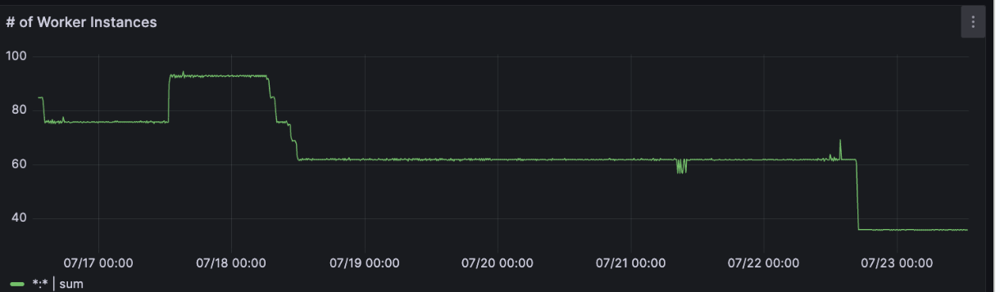
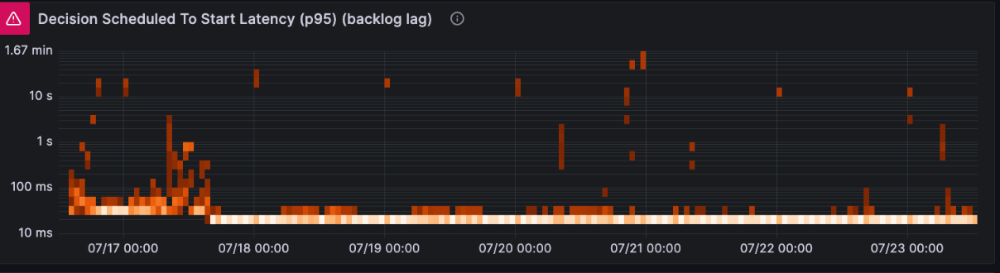
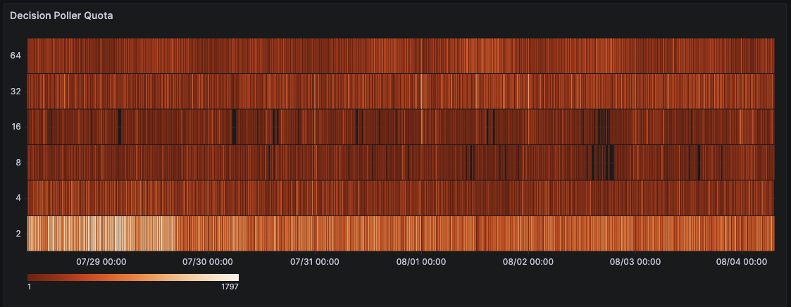
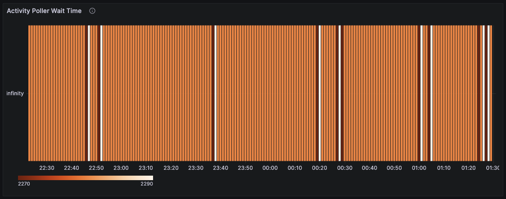

## Overview

### What AutoScaler does

Cadence Worker AutoScaler automatically adjusts your worker configuration to optimize resource utilization and prevent common scaling issues. Instead of manually tuning poller counts, AutoScaler monitors real-time metrics from your workers and the Cadence service to make intelligent scaling decisions.

The AutoScaler addresses these critical production problems:
- **Insufficient throughput capacity**: Automatically scales up pollers when task load increases, ensuring workflows are processed without delays
- **Better resource utilization**: By adjusting poller counts based on actual task demand rather than static configuration, workers utilize their allocated CPU resources more efficiently, preventing unnecessary downscaling by compute autoscalers (e.g. AWS EC2 Auto Scaling)
- **Manual configuration complexity**: Eliminates the need for service owners to understand and tune complex worker parameters

### Key benefits

- **Zero-configuration scaling**: Works out of the box with sensible defaults
- **Improved resource efficiency**: Automatically scales up when needed, scales down when idle
- **Reduced operational overhead**: No more manual tuning of poller counts and execution limits
- **Production reliability**: Prevents scaling-related incidents and workflow processing delays

### How to get started
>To get started, just add the following to your worker options:
```go
worker.Options{
    ...
    AutoScalerOptions: worker.AutoScalerOptions{
			Enabled: true,
    }
}
```

>📚 **Interactive Learning Sample**: Try our [AutoScaler sample implementation](https://github.com/cadence-workflow/cadence-samples/tree/master/cmd/samples/advanced/autoscaling-monitoring) with built-in load generation, real-time metrics collection, and monitoring dashboards. Perfect for understanding how AutoScaler responds to different workload patterns and visualizing poller state changes in real-time.

>⚠️ **Note:** If enabled, the AutoScaler will ignore these options:
```go
worker.Options{
    ...
    MaxConcurrentActivityTaskPollers: 4,
    MaxConcurrentDecisionTaskPollers: 2, 
    ...
}
```
### Compatibility considerations

**Poller Count Setup**: Before enabling AutoScaler, ensure your initial poller count equals the maximum of your decision and activity worker poller counts. This prevents AutoScaler from starting with insufficient polling capacity.

>For example:
```go
worker.Options{
    ...
    AutoScalerOptions: worker.AutoScalerOptions{
			Enabled: true,
            PollerMinCount: 2,
            PollerMaxCount: 8,
            PollerInitCount: 4, // Max of previous manually configured pollers (4 and 2 above)
    }
}
```


## Scenario: Low CPU Utilization

### Problem description

One of the most common production issues with Cadence workers occurs when compute autoscalers incorrectly scale down worker instances due to low CPU utilization. This creates a deceptive situation where workers appear to be underutilized from a resource perspective, but are actually performing critical work.

Here's what typically happens: Cadence workers spend most of their time polling the Cadence service for tasks. This polling activity is lightweight and doesn't consume significant CPU resources, leading to consistently low CPU usage metrics (often 5-15%). Compute autoscalers like Kubernetes HPA (Horizontal Pod Autoscaler) or cloud provider autoscaling groups see these low CPU numbers and interpret them as signals that fewer worker instances are needed.

When the autoscaler reduces the number of worker instances, several problems emerge:
- **Reduced polling capacity**: Fewer workers means fewer pollers actively checking for new tasks, which can delay task processing
- **Cascading delays**: As tasks take longer to be picked up, workflow execution times increase, potentially causing timeouts or SLA violations
- **Inefficient resource allocation**: The remaining workers may actually be quite busy processing tasks, but the polling overhead doesn't reflect in CPU metrics

This problem is particularly acute in environments where:
- Workflow tasks are I/O intensive rather than CPU intensive
- Workers handle high volumes of short-duration tasks
- There are periods of variable workload where quick scaling response is crucial

The fundamental issue is that traditional CPU-based autoscaling doesn't account for the unique nature of Cadence worker operations, where "being busy" doesn't necessarily translate to high CPU usage.

### How AutoScaler helps

AutoScaler solves the CPU utilization problem by providing intelligent metrics that better represent actual worker utilization. Instead of relying solely on CPU metrics, AutoScaler monitors Cadence-specific signals to make scaling decisions.

The AutoScaler tracks several key indicators:
- **Poller utilization**: How busy the pollers are, regardless of CPU usage
- **Task pickup latency**: How quickly tasks are being retrieved from task lists
- **Queue depth**: The number of pending tasks waiting to be processed
- **Worker capacity**: The actual capacity of workers to handle more work

When AutoScaler detects that workers are genuinely underutilized (based on Cadence metrics, not just CPU), it can safely reduce poller counts. Conversely, when it detects that workers are busy or task lists are backing up, it increases poller counts to improve task pickup rates.

This approach prevents the common scenario where compute autoscalers scale down workers that appear idle but are actually critical for maintaining workflow performance. AutoScaler provides a more accurate representation of worker utilization that can be used to make better scaling decisions at both the worker configuration level and the compute infrastructure level.

### Visualizing the CPU utilization problem

The following Grafana dashboards demonstrate the CPU utilization issue that AutoScaler solves:

#### CPU Utilization vs CPU Quota

*Low CPU utilization (5-15%) despite active workflow processing, leading to incorrect downscaling by compute autoscalers*

#### Worker Instance Count Impact

*Worker instance count fluctuations caused by CPU-based autoscaling decisions*


## Scenario: Task List Backlogs

### Understanding task list imbalances

Task list backlogs occur when some task lists receive more traffic than their allocated pollers can handle, while other task lists remain underutilized. This imbalance is common in production environments with multiple workflows, domains, or variable traffic patterns.

The core problem stems from static poller allocation. Traditional Cadence worker configurations assign a fixed number of pollers to each task list, which works well for predictable workloads but fails when:

- **Traffic varies between task lists**: Some task lists get heavy traffic while others remain quiet
- **Workload patterns change over time**: Peak hours create temporary backlogs that resolve slowly
- **Multi-domain deployments**: Traffic spikes in one domain affect resource availability for others
- **Workflow dependencies**: Backlogs in upstream task lists cascade to dependent workflows

These imbalances lead to uneven workflow execution times, SLA violations, and inefficient resource utilization. Manual solutions like increasing worker counts or reconfiguring poller allocation are expensive and reactive.

### AutoScaler's poller management

AutoScaler solves task list backlogs through dynamic poller management that automatically redistributes polling capacity based on real-time demand.

Key capabilities include:

**Automatic backlog detection**: AutoScaler monitors task list metrics like queue depth, pickup latency, and task arrival rates to identify developing backlogs before they become critical.

**Dynamic reallocation**: When a task list needs more capacity, AutoScaler automatically moves pollers from underutilized task lists. This reallocation happens without worker restarts or manual intervention.

**Pattern learning**: The system learns from historical traffic patterns to anticipate regular peak periods and preemptively allocate resources.

**Safety controls**: AutoScaler maintains minimum poller counts for each task list and includes safeguards to prevent resource thrashing or system instability.

This approach ensures that polling capacity is always aligned with actual demand, preventing backlogs while maintaining efficient resource utilization across all task lists.

### Visualizing task list backlogs

The following dashboard shows how AutoScaler addresses task list imbalances:

#### Decision Scheduled to Start Latency (p95)

*High latency indicates task list backlogs that AutoScaler automatically resolves by redistributing pollers*


## Metrics Guide

### Key metrics to monitor

**Client Dashboards** http://localhost:3000/d/dehkspwgabvuoc/cadence-client
> **Note**: Make sure to select a Domain in Grafana for the dashboards to display data. The dashboards will be empty until a domain is selected from the dropdown.


Monitor these key metrics to understand AutoScaler performance:


#### Decision Poller Quota
- **Description:** Track decision poller count over time
- **Name:** `cadence_concurrency_auto_scaler_poller_quota_bucket`
- **WorkerType:** DecisionWorker
- **Type:** Heatmap


#### Activity Poller Quota
- **Description:** Track activity poller count over time
- **Name:** `cadence-concurrency-auto-scaler.poller-quota`
- **WorkerType:** ActivityWorker
- **Type:** Heatmap


#### Decision Poller Wait Time
- **Description:** Track decision poller wait time over time
- **Name:** `cadence-concurrency-auto-scaler.poller-wait-time`
- **WorkerType:** DecisionWorker
- **Type:** Heatmap


#### Activity Poller Wait Time
- **Description:** Track activity poller wait time over time
- **Name:** `cadence-concurrency-auto-scaler.poller-wait-time`
- **WorkerType:** ActivityWorker
- **Type:** Heatmap
